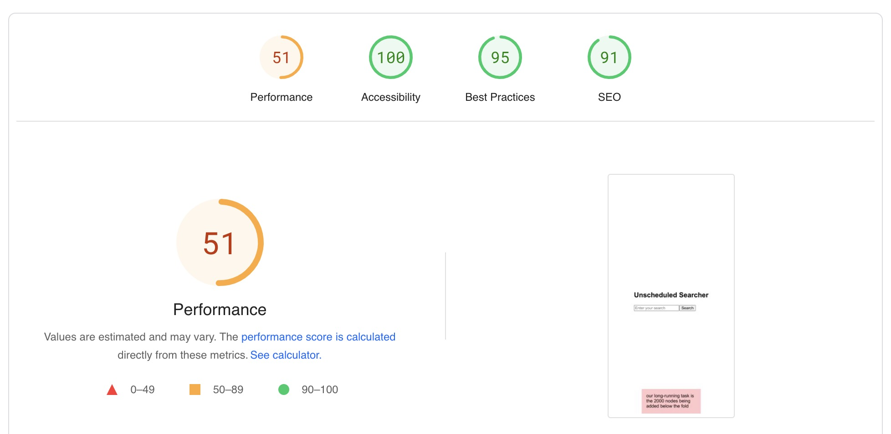
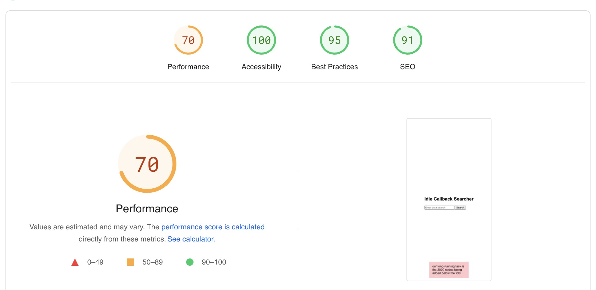
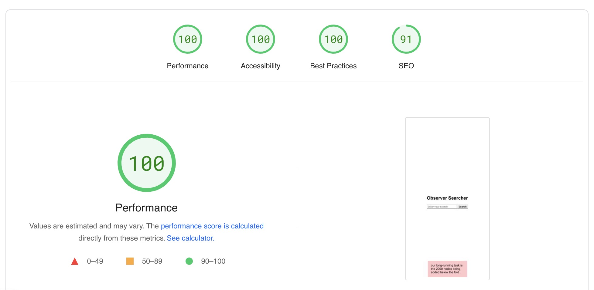

# Lazy Loading Strategies for Optimizing Web Performance

This repository provides two distinct strategies to optimize web performance by effectively managing the loading of scripts using different approaches. The strategies discussed here aim to reduce the impact of long-running tasks on page load, thus enhancing the user experience. The implemented techniques involve script injection combined with the `requestIdleCallback` or the Intersection Observer API. Below, we delve into each strategy's implementation and its potential benefits.

## Unscheduled results

## Strategy #1: `requestIdleCallback` & Script Injection

This strategy leverages the `requestIdleCallback` API to ensure that a given task is executed only when the browser is idle. By implementing this approach, any user interactions occurring on the page during load are prioritized and handled before the remaining page content is loaded. This is achieved through the dynamic injection of scripts.

### Implementation

In the `load-script.js` module, the `loadScript` function dynamically loads scripts and incorporates promise-based handling for loading and error scenarios.

The main `App.jsx` component utilizes `requestIdleCallback` to ensure the asynchronous loading of an external script (`/count-appender.js`) without interrupting critical rendering tasks.

## Strategy #2: Intersection Observer & Script Injection

This strategy capitalizes on the Intersection Observer API, which detects when an element is about to enter or has entered the viewport. The script loading is deferred until an element comes into view, reducing the impact on the initial page load. However, this method should be used cautiously to avoid negative impacts on user experience due to layout shifts.

### Implementation

In this approach, the `react-intersection-observer` package is employed to manage the Intersection Observer instance. The `App.jsx` component uses this package to load the external script (`/count-appender.js`) when the target element (`#appendZone`) is about to become visible.

## Performance Results

The performance of these strategies was assessed using Google PageSpeed Insights. The results for unscheduled long-running tasks, tasks scheduled with `requestIdleCallback`, and tasks scheduled with Intersection Observer were 51, 70, and 100, respectively. This demonstrates the effectiveness of these strategies in improving web performance, with Intersection Observer yielding the best results.

Note: While these strategies provide significant performance benefits, consider the potential trade-offs, such as layout shifts in the case of Intersection Observer. Careful implementation and testing are essential to ensure a seamless user experience.

Feel free to explore the provided code snippets and integrate these strategies into your web development projects to optimize loading times and enhance overall user satisfaction.

## Reference

[Enhance Performance with Late Tasks](https://rangle.io/blog/enhance-performance-with-late-tasks)
